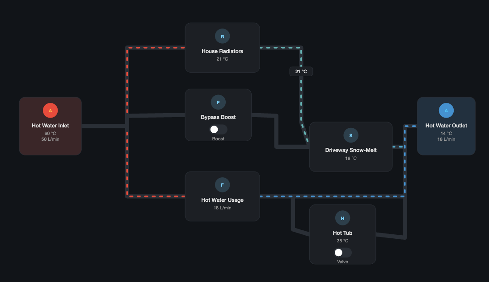
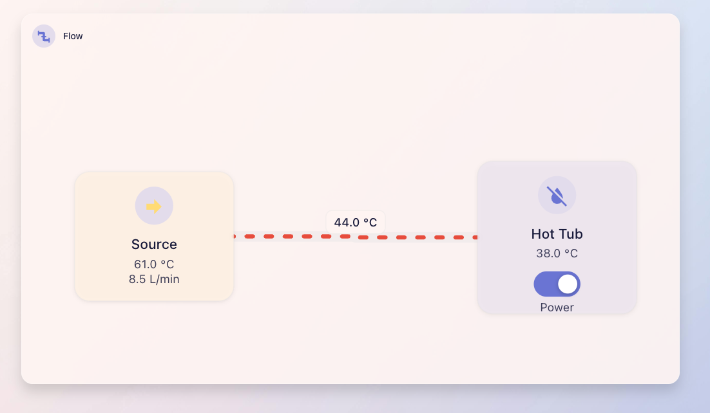

# schematic-flow-card

[](https://github.com/hacs/integration)
[](https://github.com/birkir/home-assistant-schematic-flow-card/releases)
[](./LICENSE)

A P&ID-style schematic flow card for Home Assistant. Author your diagram in
YAML with explicit coordinates, bind each pipe and node to any entity —
temperature, flow, voltage, amperage, whatever — and get an animated,
theme-aware SVG that reacts to live state.



Built because every existing HA flow card hard-codes an electrical grid
topology. This one is topology-agnostic: you describe the nodes, you draw
the pipes, and the card renders exactly what you told it to.

## A smaller example



Two nodes, one pipe, one inline toggle. The pipe is gated by the Hot Tub's
valve — when the switch is off the pipe dims and the flow animation stops.
Everything picks up HA's active theme automatically.

## Why this card

- **No auto-layout.** You provide coordinates. The card never rearranges
  your diagram. This is the whole point.
- **Domain-agnostic.** A pipe binds a `color` entity (drives stroke color),
  an `animation` entity (drives flow-dash speed), and any number of
  `labels` along the path. It doesn't care whether those entities measure
  temperature, watts, cubic meters per hour, or torque.
- **Home Assistant native aesthetic.** Uses HA theme CSS variables, rounded
  cards, Material-style toggles. Drops into a default dashboard without
  looking out of place.
- **Click-through.** Click a node or a pipe to open HA's more-info dialog
  for the underlying entity. Click a rendered toggle to call the service.

## Install

### HACS (recommended)

1. Open HACS in Home Assistant.
2. Click the ⋮ menu → **Custom repositories**.
3. Add `https://github.com/birkir/home-assistant-schematic-flow-card`
   with category **Dashboard**.
4. Install **Schematic Flow Card** from the list.
5. Hard-refresh the browser (Cmd-Shift-R / Ctrl-Shift-R).
6. Add a card with `type: custom:schematic-flow-card`.

HACS automatically registers the Lovelace resource for you.

### Manual

1. Download `schematic-flow-card.js` from the
   [latest release](https://github.com/birkir/home-assistant-schematic-flow-card/releases/latest).
2. Drop it into `/config/www/`.
3. Register the resource: **Settings → Dashboards → ⋮ → Resources → Add**
   - URL: `/local/schematic-flow-card.js`
   - Type: JavaScript module
4. Hard-refresh and add a card with `type: custom:schematic-flow-card`.

See [`example/README.md`](example/README.md) for a full walkthrough with
the Vættaborgir hot-water reference diagram.

## Building from source

```bash
npm install
npm run build     # → dist/schematic-flow-card.js
npm test          # vitest
npm run dev       # local preview at http://localhost:5173 (no HA required)
```

## Releasing

1. Bump `version` in `package.json` and update `CHANGELOG.md`.
2. Commit: `git commit -am "Release vX.Y.Z"`.
3. Tag: `git tag vX.Y.Z && git push --follow-tags`.
4. The [release workflow](.github/workflows/release.yml) builds the bundle
   and attaches `schematic-flow-card.js` to the GitHub release. HACS picks
   up the new version from there — no manual steps.

## Config schema

```yaml
type: custom:schematic-flow-card
title: Hot Water
subtitle: Utility room
icon: mdi:pipe

canvas:
  width: 1160        # SVG user units — the card scales to fit
  height: 660

header_chips:
  - entity: sensor.inlet_temp
    label: Inlet
    icon: mdi:thermometer
    color: { scale: temperature }

# Optional defaults merged into every pipe.
defaults:
  pipes:
    color: { scale: temperature }
    animation: { entity: sensor.inlet_flow, min: 0, max: 80 }

nodes:
  inlet:
    x: 40
    y: 260
    width: 150
    height: 140
    label: Hot Water Inlet
    kind: source        # source | sink | process | bypass
    icon: mdi:arrow-right-bold
    primary_entity: sensor.inlet_temp
    color: { entity: sensor.inlet_temp, scale: temperature }
    labels:
      - sensor.inlet_temp
      - sensor.inlet_flow
  boost:
    x: 440
    y: 240
    label: Bypass Boost
    kind: bypass
    # An inline toggle, rendered at the bottom of the node tile.
    # Shorthand: `control: switch.driveway_boost`
    control:
      entity: switch.driveway_boost
      label: Boost
  outlet:
    x: 1000
    y: 260
    kind: sink
    label: Outlet
    labels: [sensor.outlet_temp]

pipes:
  - id: inlet_to_outlet
    from: inlet
    to: outlet
    # Absolute canvas coordinates. Omit for auto orthogonal route.
    waypoints:
      - [300, 330]
      - [970, 330]
    color:
      entity: sensor.inlet_temp
      scale: temperature       # or: electricity | flow | inline `stops:`
    animation:
      entity: sensor.inlet_flow
      min: 0
      max: 80
    gated_by: switch.main_valve   # shorthand for { entity, active_states: [on] }
    labels:
      - entity: sensor.inlet_flow
        position: above        # above | below | start | mid | end | along
        # offset: 0.4          # used only with position: along
        unit: L/min
```

### Entity display shorthand

Everywhere an entity is rendered — node labels, pipe labels, header chips,
annotations — the config accepts either a bare string (`sensor.inlet_temp`)
or an object (`{ entity, label?, icon?, unit?, color? }`). Unit
auto-detects from the entity's `unit_of_measurement` unless overridden.

### Color scales

Three built-in presets: `temperature`, `electricity`, `flow`. For anything
else, supply `stops:`:

```yaml
color:
  entity: sensor.pv_watts
  stops:
    - { at: 0,     color: '#4a90e2' }
    - { at: 2000,  color: '#27ae60' }
    - { at: 8000,  color: '#e74c3c' }
```

Values below the first stop clamp to its color; values above the last stop
clamp to its color; values between stops linearly interpolate.

### Animation

`animation.entity` drives dash speed. `min` / `max` are in the entity's own
units — the renderer normalizes to 0..1 and clamps to a duration between
0.5 s (at max) and 4 s (just above min). A value at or below `min` disables
the animation entirely (the pipe still draws, just static).

### Gates

`gated_by` accepts a bare entity id (`switch.foo` → active when state is
`on`) or an object with explicit active states:

```yaml
gated_by:
  entity: cover.main_valve
  active_states: [open]
```

A closed gate dims the pipe to `--divider-color` and stops the animation.
Gates do not propagate transitively — if you want a whole chain to go dark,
gate each pipe in the chain.

### Pipe waypoints and anchors

- Pipes auto-select which node edge to attach to, based on the first and
  last waypoint (or the target node center if no waypoints). Override with
  `from_anchor` / `to_anchor` (`left | right | top | bottom | center`).
- `from_offset: [dx, dy]` / `to_offset: [dx, dy]` nudge the anchor point
  relative to its edge — useful when several pipes meet the same node.
- Waypoints are absolute canvas coordinates. Render order = list order in
  `pipes:` — later pipes draw on top.

## Known limitations (MVP)

- No visual editor. YAML-first.
- No Bézier pipes. Routing is polyline-only (the P&ID aesthetic).
- No conditional visibility (`visible_if:`) yet.
- Icons rely on HA's `<ha-icon>` element being present at runtime; the
  bundled renderer does not ship an icon font.
- Pipe width is fixed. This is not a Sankey card — width does not encode
  magnitude.

## License

MIT.
